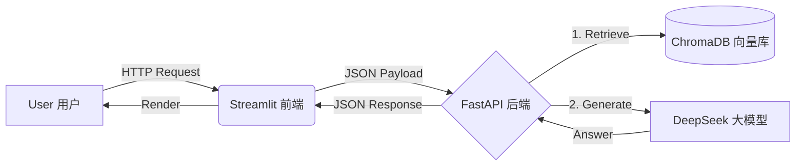

# 🧠 SmartBrain - 你的专属 RAG 知识库助手


SmartBrain 是一个基于 **RAG (检索增强生成)** 技术的垂直领域 AI 助手。
它采用了 **前后端分离** 架构，能够基于本地知识库（ChromaDB）提供精准的问答服务，解决了大模型在特定领域“胡说八道”的问题。

## 🏗️ 系统架构



## 🚀 核心功能

* **📚 知识库检索**：基于 ChromaDB 的向量语义检索。
* **🧠 深度思考**：接入 DeepSeek V3 大模型进行推理。
* **⚡ 高效接口**：基于 FastAPI 的 RESTful API 设计。
* **🖥️ 交互界面**：Streamlit 打造的流式对话窗口。

## 🛠️ 快速开始

### 1. 克隆仓库

```bash
git clone https://github.com/rexinshimin1234/SmartBrain-2026.git
cd SmartBrain-2026

```

### 2. 安装依赖

```bash
pip install -r requirements.txt

```

### 3. 配置环境

新建 `.env` 文件，填入你的 API Key：

```text
DEEPSEEK_API_KEY=sk-xxxxxxxxxxxx

```

*(注意：请将 `sk-xxxxxxxxxxxx` 替换为你自己的 DeepSeek API Key)*

### 4. 启动服务

**后端 (API)**:

```bash
uvicorn api:app --reload

```

**前端 (UI)**:

```bash
streamlit run app.py

```

## 📂 目录结构

* `api.py`: FastAPI 后端逻辑
* `app.py`: Streamlit 前端界面
* `chroma_db/`: 向量数据库文件 (自动生成)
* `requirements.txt`: 项目依赖清单


